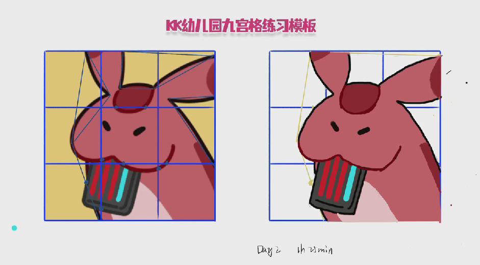
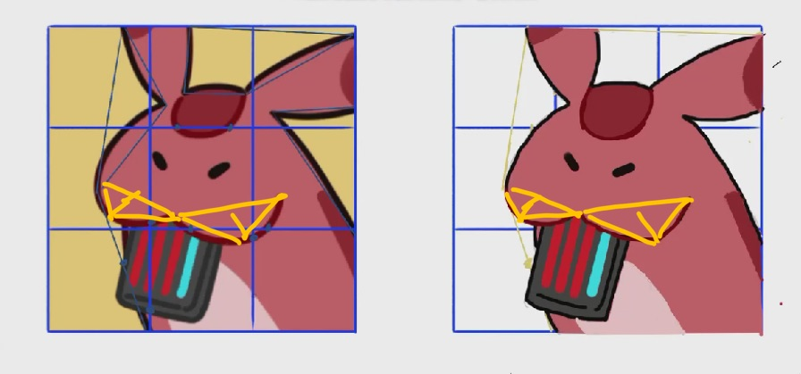

- [[绘画抓型打卡]]
	- Day2
	  collapsed:: true
		- 
		- 感想：不是很会打框（只能抓住几个三角形的点，剩下的就都是用点来标识位置了）
			- 线条也不太好，最后是通过反复画来调整弧形的，调完了也就那样，同时也反复叠图来确认位置是不是靠谱。
			- 肚子那块居然是一笔画成的，叠图也显示比较准，惊呆了。
			- 
			- 烬楠说嘴这里可以用两个小三角形来概括，这样可以让弧度更短，画出来更精确。
- [[中庭角落的情书信箱]]
	- [[应用]] 如何通过 Bypass (旁路) Paywalls阅读经济学人？
		- https://forum.freemdict.com/t/topic/1436
		- 绕过主流杂志的付费墙
- ！思い出せない……何も。
- ピアリス！君ねとっても可愛い名前だと思うでも、多分ってどうして？』
-